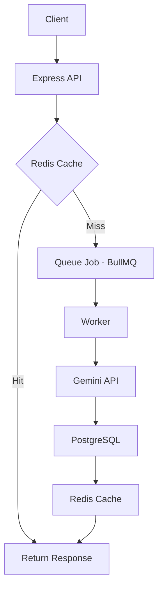

# Promply.ai

AI-powered messaging backend built with Redis caching and asynchronous job processing.

---

## Overview

Promply.ai is a scalable backend system that processes user messages and returns AI-generated responses using a non-blocking architecture.

The system separates request handling from heavy AI processing to ensure performance and scalability.

---

## Architecture



---

## Tech Stack

- Node.js
- Express.js
- BullMQ
- Redis
- PostgreSQL
- Gemini API
- Docker

---

## How It Works

1. User sends a message.
2. Server checks Redis for cached response.
3. If not cached, a job is added to BullMQ.
4. Worker processes the job and calls Gemini API.
5. Response is stored in PostgreSQL and cached in Redis.
6. Response is returned to the user.

---

## Getting Started

```bash
git clone https://github.com/yourusername/promply.ai.git
cd promply.ai
npm install
```

Create a `.env` file:

```
PORT=your_port
REDIS_HOST=localhost
REDIS_PORT=6379
DATABASE_URL=your_database_url
GEMINI_API_KEY=your_api_key
```

Run services:

```bash
docker-compose up -d
npm run dev
npm run worker
```

---

## License

MIT
